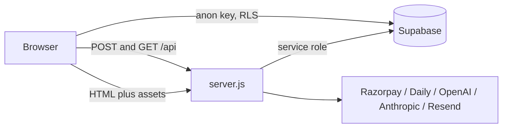

# Serenest

Aligning minds, enhancing lives — India's clinical telepsychiatry platform: online psychiatry, therapy, screening, professional onboarding, and clinician education (Serenest Academy).

**Live:** [serenest.in](https://www.serenest.in) · Academy: [/academy](https://www.serenest.in/academy) · Admin: `/admin`

---

## Architecture

One Node web service serves everything:

- **Frontend:** React 18 + Vite SPA (`src/`), ~50 lazy-loaded routes defined in `src/App.jsx`.
- **Backend:** Express 5 (`server.js`) — serves the built `dist/`, exposes the `/api/*` endpoints, injects per-route SEO tags server-side, and runs a cron that auto-publishes scheduled social posts.
- **Database & auth:** Supabase (Postgres + Auth). The browser uses the anon key (RLS-protected); the server uses the service-role key.
- **Integrations (all optional, enabled by env vars):** Razorpay (payments), Daily.co (video), OpenAI (Serenest Guide chat), Anthropic (Academy/social content generation), Resend (email), CallMeBot (WhatsApp pings), Telegram (alerts), Instagram/LinkedIn (auto-posting).



## Run locally

```bash
npm install
cp .env.example .env      # fill in at least the Supabase values
npm run dev               # Vite dev server on :5173, proxies /api to :3000
npm start                 # Express API + serves dist/ on :3000
```

For a production-like run: `npm run build && npm start`, then open `http://localhost:3000`.

Check `http://localhost:3000/api/health` to see which integrations are configured.

## Environment variables

See `.env.example` for the full annotated list. Summary:

| Variable | Required | Purpose |
|----------|----------|---------|
| `VITE_SUPABASE_URL`, `VITE_SUPABASE_ANON_KEY` | Yes | Browser Supabase client (auth, consultation chat) |
| `SUPABASE_URL`, `SUPABASE_SERVICE_KEY` | Yes | Server Supabase client (all `/api/*` data) |
| `ADMIN_SECRET` | Yes | Protects all admin API routes and the `/admin` panel |
| `PORT` | No (3000) | Server port (Render sets this automatically) |
| `CORS_ORIGIN` | No | Cross-origin allow-list, comma-separated. Production defaults to `https://www.serenest.in` + `https://serenest.in` — never `*` |
| `RAZORPAY_KEY_ID`, `RAZORPAY_KEY_SECRET`, `DEFAULT_FEE_INR` | No | When both keys are set, bookings require verified payment |
| `DAILY_API_KEY` | No | Video/audio consultation rooms |
| `OPENAI_API_KEY`, `OPENAI_MODEL` | No | Serenest Guide site assistant |
| `ANTHROPIC_API_KEY` | No | Admin AI content generation (Academy + social) |
| `RESEND_API_KEY`, `NOTIFY_FROM`, `NOTIFY_EMAIL` | No | Team + patient email notifications |
| `CALLMEBOT_WHATSAPP_APIKEY`, `CALLMEBOT_WHATSAPP_PHONE` | No | Team WhatsApp pings |
| `TELEGRAM_BOT_TOKEN`, `TELEGRAM_CHAT_ID` | No | Team Telegram alerts |
| `INSTAGRAM_*`, `LINKEDIN_*` | No | Social auto-posting (Admin → Social Media) |
| `VITE_WA_CHANNEL_LINK` | No | WhatsApp welcome link for approved professionals |
| `VITE_API_URL` | No | API base for the frontend; empty = same origin |

## Features & how they work

| Feature | Route(s) | How it works |
|---------|----------|--------------|
| Booking | `/book` | Form → optional Razorpay payment (server-verified signature) → `POST /api/bookings` → team notified. Admin confirms/assigns in `/admin` |
| Screening | `/screening` | PHQ-9 + GAD-7 with severity scoring and a safety alert on suicidal ideation → `POST /api/screening` |
| Consultation | `/consultation/:id` | Private link keyed on the appointment uuid. Video/audio via Daily.co; chat via Supabase `chat_messages` realtime. Prescription at `/consultation/:id/prescription` |
| Patient portal | `/patient/login`, `/patient/dashboard` | Supabase phone-OTP or email login; bookings matched by verified email/phone |
| Professional onboarding | `/professionals/apply` | Application → admin review → approval unlocks the portal and directory listing |
| Professional portal | `/professionals/login`, `/professionals/portal` | Passwordless magic link; server resolves the profile from the verified token email only |
| Admin panel | `/admin` | Full ops dashboard (bookings, screenings, applications, HR, messages, traffic, Academy CMS, social planner). Enter `ADMIN_SECRET` to sign in; installable as a separate PWA |
| Academy | `/academy` | Public landing page (indexed); program content requires a free account |
| Serenest Guide | floating button | OpenAI-powered site concierge; the key stays server-side |
| Social auto-posting | Admin → Social Media | Scheduled posts published by an every-minute server cron |

## Security model

- The service-role key, `ADMIN_SECRET`, and every integration secret live only on the server.
- Admin endpoints require the `x-admin-secret` header; deny-by-default when `ADMIN_SECRET` is unset.
- Supabase RLS: patients read only their own appointments (verified email/phone); professionals read/update only their own application row; everything else is insert-only for clients and read via the server.
- `GET /api/bookings/:id` requires admin, the patient, or the assigned professional. Prescription links work anonymously only with the full appointment uuid (unguessable); short refs require a matching login. Video rooms are only created for real appointments.
- Rate limits: 200 req/15 min on `/api/`, 30/hour on the public submission endpoints.

## Database (Supabase)

1. Create a project at [supabase.com](https://supabase.com).
2. Run `supabase/schema.sql` in the SQL Editor (idempotent).
3. Run each file in `supabase/migrations/` in filename order (also idempotent) — for existing databases, at minimum run `2026_07_03_tighten_rls.sql`.
4. Enable Email (and optionally Phone) auth providers, and set the Site URL to your domain.

See `SUPABASE.md` for details.

## Deploying

Render (primary): see `DEPLOY.md` and `render.yaml`. Build `npm install && npm run build`, start `node server.js`, bind `0.0.0.0:$PORT`. A Railway config (`railway.toml`) also exists.

Note: the free Render plan spins down after 15 min of inactivity (cold starts) and the filesystem is ephemeral — all persistent data belongs in Supabase.

## SEO

- Per-route titles/descriptions/JSON-LD live in `src/lib/seo.js` (`ROUTE_SEO`); the server injects them between the `SEO_HEAD` sentinels in `index.html`, and `useSEO` keeps them in sync on client navigation.
- `public/sitemap.xml` + `public/robots.txt`; 301 keyword aliases, 410 for retired URLs, real 404 status for unknown routes.
- When you add a route in `src/App.jsx`, also add it to `VALID_ROUTES` in `server.js` and to `ROUTE_SEO` — then run `npm run verify:seo` against a running server to audit.

## Repo map

```
serenest/
├── server.js               Express API + SEO injection + static serving
├── index.html              Vite entry (SEO sentinels, PWA meta)
├── src/
│   ├── App.jsx             All routes (lazy-loaded)
│   ├── pages/              Page components (Home, Booking, Screening, Admin, …)
│   ├── layouts/            SiteLayout (header/footer/nav)
│   ├── components/         Assistant, prescription doc, cookie consent, …
│   ├── lib/                api.js, supabase.js, seo.js, useAuth, data
│   └── server/             Server-only modules (notify, AI, social poster)
├── public/                 Static assets → dist/ (manifests, sitemap, og-image)
├── supabase/               schema.sql + migrations/
├── scripts/                verify-seo.mjs, seed-social-posts.mjs
├── render.yaml             Render blueprint (env var checklist)
└── DEPLOY.md / SUPABASE.md Step-by-step guides
```
